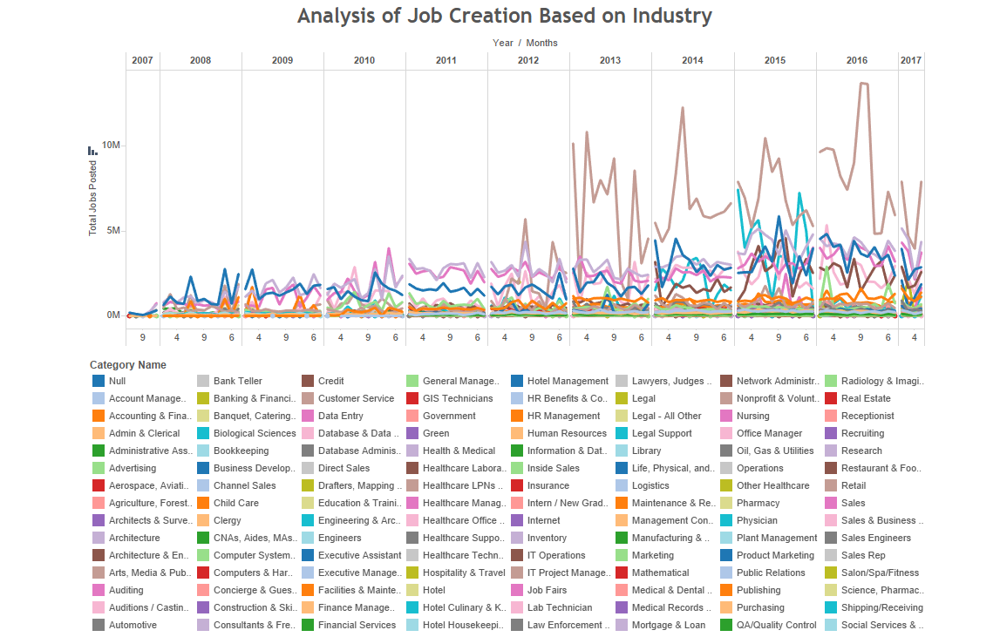

### Correlation One Datathon - 2017
## TEAM 25

### Topic Question  
Given dataset post the financial crisis, the numbers show an increasing trend in all comparisons you make.  
Hence, we set out to test the correlation of number of jobs created (per year/ quarter, per state) to all datasets available at hand, and see if we can find something significant.

* Logically, states which are big in size (and relatabaly have higher population), will have higher number of jobs created. e.g. California, Texas. But is there in anomaly here?
* States which have more jobs concentrated in a smaller area will have comparably higher priced real estate, such as Bay Area near San Francisco. Would we see that trend in most big cities?
* What is the impact of the economic slowdown in different types of industries? Which industries were affected the highest and which industries were quick to revive?
* What is the impact of Cost of Living in Job Creation? How were individual states affected by the recession and how is the recovery?
* With jobs shifting towards more technology and STEM based, we wanted to see how education corresponds to this change in job industry.

Most of the observations showed what you would generally expect, but certain results were intriguing.

### Summary  
(1) **jobs**:
Based on the visualizations obtained, we could not decipher any strong co-relation of the housing price index with the job creation. However, we found a negative trend in the housing prices for California post-recession which doesn't look like improving. Meanwhile, the state of Montana showed a considerable increase in the cost.  
During the recession, the state of California, Texas and New York went through the maximum impact on job creation. While the recovery process for Texas and California has been remarkably good, while New York which depends most on the financial sector, has a slow recovery.

(2) **econ_state**:
You would expect big states such as California, Texas, to churn out jobs in big number, from all sectors. That is what we found.
Jobs were clustered on Eastern States; and you see a significant increase in the number of jobs post 2012.
States which have higher population show higher GDP per Capita; and thus show a direct relation with increase in number of jobs. Unemployment rate in northwestern states seems higher than the rest, and should further be explored.  
Smaller states have shown most per capita job gains.

(3) **econ_federal**:
Increase in number of jobs is sign of a steadily recovering economy. That should result in stable inflation rates, and slight growth in interest rates in early periods of recovery.
We expected a positive correlation between unemployment rates and all variables in this dataset. Even though we observed a positive trend between the two, we did not come across anything significant. We can conclude that factors such as CPI, increase in interest rates, go hand in hand with unemployment in population; but do not affect it remarkably.

(4) **real_estate**:
Based on the visualizations and analysis obtained, we can see that the accounting firms and financial category companies are having a gradual increase in the job creation and thus show improvements every year, while categories like the retail sector boomed in this period with a multi-fold increase in job creation.  
Compared to pre-recession metrics in its own sector as well as other industries in the post-recession phase, the retail sector has been faring really well. Similarly, Health, Medical and Nursing categories also saw a steady rise. While, we found an anomaly in the Transportation sector, where there has been a sharp decline in the job creation.  

(5) **education**:
Initially, we wanted to explore how education has evolved overtime in correspondence to the changing job market, unfortunately we are not given education info as it changes over time, but as a summary from the 2011-2015 time period.
Instead, we wanted to investigate the *myth of whether places with a higher percentage of people studying STEM fields have a higher chance of employment (lower unemployment rate), and whether this would also lead to a higher average income*.

| Data | Observations |
|:---------:|:------------------|
| **jobs** | Technology sector brought more dough; retail sector had the numbers to show. |
| **econ_state** | Expected big states to impact results; they did. |
| **econ_federal** | Expected big positive correlation among factors; nothing significant found. |
| **real_estate** | Direct correlation seen between increase in jobs and house prices. Hawaii was a surprise. |

### Technical Summary  
(1) **jobs**:
Processing 5 million rows was a big task; but once aggregated over year and states, it was easier to compute operations and merge data.
The correlation between number of jobs growth and GDP growth is **0.204**.  

(2) **econ_state**:
(Refer Tableau Dashboard - if finished - put link)

(3) **econ_federal**:
We tried finding correlation between factors in econ_ federal. The following were the results - 
1. Unemployement vs CPI = **0.217**
2. Unemployement vs shortterm interest rate = 0.035
3. Unemployement vs longterm interest rate = **0.287**
4. Unemployement vs nonfarm_payrolls = 0.158
As the correlation is significantly low, we decided not to pursue this dataset further.

(4) **real_estate**:
The analysis was made assuming stratified job postings in the portal, which might not be true, as this website could have come to prominence in use after the economic slowdown. Thus, the analysis was made relative to categories which will nullify a gradual trend in the data.
(Refer Tableau Dashboard - if finished - put link)

(5) **education**:
For this investigation, we focused on data from the econ_state and education files.
*education*: we filtered the data so that we merged everything to be sorted by state, and calculated the percentage of people who studied STEM majors from each state (computer science, statistics, engineering and related fields)
*econ_state*: we sampled the most recently measured per capita income and unemployment rate from each state in 2016.
After obtaining data from the two above data files, we created a new dataframe to graph our sorted data. 

**STEM % VS Unemployment Rate**
There is a weak positive correlation between the percent of people studying STEM and the unemployment rate. Each dot on the scatterplot represents a distinct US state. This is surprising since the supply for STEM related jobs seems to be in high demand, yet places with a higher percentage of people studying STEM fields also have higher unemployment rates.  

**STEM % VS Per Capita Income**
There is a weak positive correlation between the percent of people studying STEM and Per Capita Income for each state. Each dot on the scatterplot represents a distinct US state. This relationship has a stronger correlation than the previous graph, though a few many states lie far above the line of best fit, indicating high per capita incomes despite the low percentage of students studying STEM fields in that state. 

Unfortunately, there is not a strong enough correlation to draw strong conclusions for the questions posted above. We can say though, that in the data we have observed places with higher percentage of students studying STEM tend to have slightly higher rates of unemployment and higher per capita income recently in 2016.
